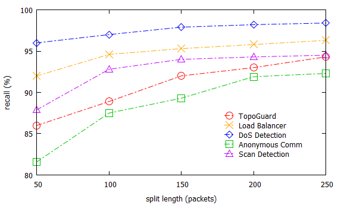

# gnuplot

`cd “data/”`

`set xlabel “Delay (ms)”` 

`set xrange[0.02:0.1]`

`set xtics 0.02,0.02,0.1`

`set ylabel “Accuracy (%)”`

`set yrange[50:100]`

`set ytics 50,10,100`

`plot "accuracy.txt" using 1:2 title "50 bps" with linespoints lc rgb "red" lw 3 pt 6 ps 2,'' using 1:3 title "100 bps" with linespoints lc rgb "orange" lw 3 pt 2 ps 2,'' using 1:4 title "150 bps" with linespoints lc rgb "blue" lw 3 pt 12 ps 2,'' using 1:5 title "200 bps" with linespoints lc rgb "web-green" lw 3 pt 4 ps 2,'' using 1:6 title "250 bps" with linespoints lc rgb "dark-magenta" lw 3 pt 8 ps 2`

`set key center`

`set key reverse`

`set key Left`

`set key samplen 2`

`replot`

### accuracy

`set ylabel “time(s)”`

`unset yrange`

`plot "time.txt" using 1:2 title "delay=2ms" with linespoints,'' using 1:3 title "delay=4ms" with linespoints,'' using 1:4 title "delay=6ms" with linespoints,'' using 1:5 title "delay=8ms" with linespoints,'' using 1:6 title "delay=10ms" with linespoints`

### time

`set xlabel "split length (packets)"`

`set ylabel "recall (%)"`

`set yrange[80:100]`

`set ytics 80,5,100`

`plot 'recall.txt' using 1:2 title 'TopoGuard' with linespoints lc rgb 'red' lw 1 pt 6 ps 2 dt 4, '' using 1:3 title 'Load Balancer' with linespoints lc rgb 'orange' lw 1 pt 2 ps 2 dt 4, '' using 1:4 title 'DoS Detection' with linespoints lc rgb 'blue' lw 1 pt 12 ps 2 dt 4, '' using 1:5 title 'Anonymous Comm' with linespoints lc rgb 'web-green' lw 1 pt 4 ps 2 dt 4, '' using 1:6 title 'Scan Detection' with linespoints lc rgb 'dark-magenta' lw 1 pt 8 ps 2 dt 4`

`set key at 230,82`

`set key reverse Left samplen 2`

`replot`

### recall

