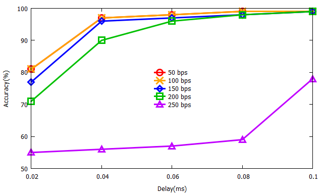
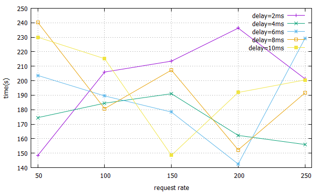

# gnuplot

`cd “data/”`

`set grid`

`set xlabel “request rate”` 

`set xrange[45:255]`

`set ylabel “accuracy(%)”`

`set yrange[48.5:53.5]`

`plot "accuracy.txt" using 1:2 title "delay=2ms" with linespoints,'' using 1:3 title "delay=4ms" with linespoints,'' using 1:4 title "delay=6ms" with linespoints,'' using 1:5 title "delay=8ms" with linespoints,'' using 1:6 title "delay=10ms" with linespoints`

### accuracy

`set ylabel “time(s)”`

`unset yrange`

`plot "time.txt" using 1:2 title "delay=2ms" with linespoints,'' using 1:3 title "delay=4ms" with linespoints,'' using 1:4 title "delay=6ms" with linespoints,'' using 1:5 title "delay=8ms" with linespoints,'' using 1:6 title "delay=10ms" with linespoints`

### time

